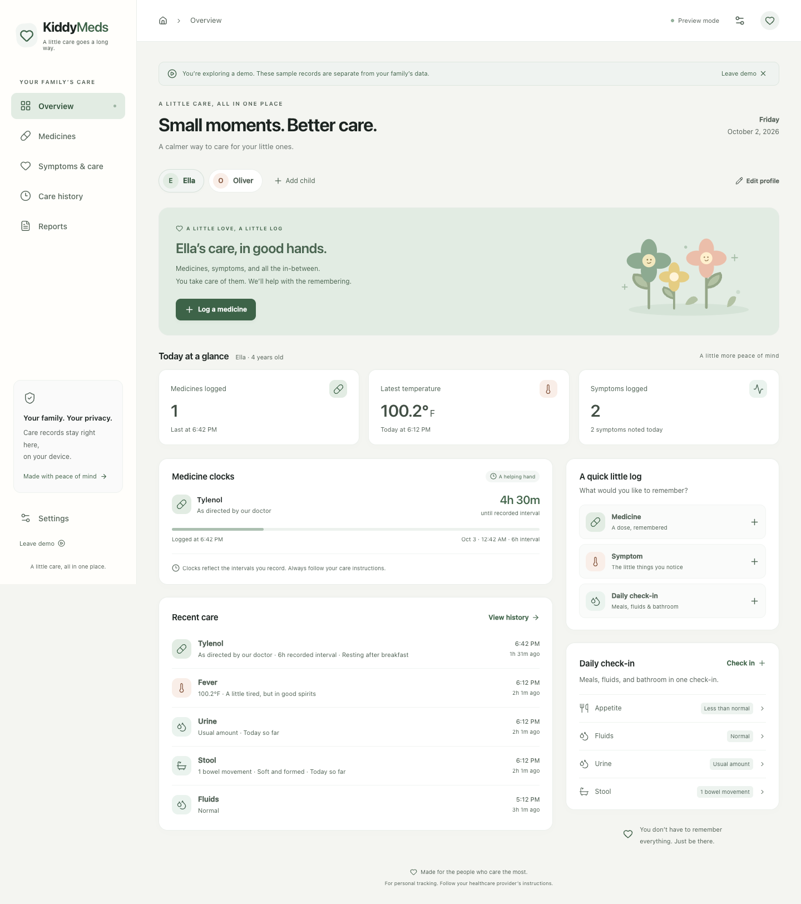

# KiddyMeds

A little care, all in one place. A private, offline family care tracker rebuilt with Next.js, React, and TypeScript.

The design keeps the original project's purpose—helping parents remember medicine, symptoms, and daily care—with the warm sage palette from [Note Repertoire](https://www.noterepertoire.com/), a calm dashboard, and a responsive interface.



## Run locally

Requires Node.js 22 or newer.

```sh
npm ci
npm run dev
```

Open [localhost:3000](http://localhost:3000). Dependencies are already installed in the refactored workspace.

To preview the production app, including offline support:

```sh
npm run build
npm start
```

`npm run preview` also serves the production export. The service worker runs only in production so it doesn't interfere with development.

## What's included

- **Family overview:** quick logging, a daily summary, recent care, and individual medicine clocks.
- **Child profiles:** independent records, profile colors, optional birthdays, and an explicit edit flow.
- **Medicine records:** common and custom shortcuts, free-text dosage, an optional instructed interval, backdated entries, and notes. The last recorded dose appears when logging the same medicine.
- **Symptoms:** 17 common shortcuts with distinct icons, search, category filters, and custom observations. Optional details tailored to each symptom include cough sound/frequency, pain location, earache side, rash appearance, dizziness description, temperature method, and scoped vomiting/diarrhea counts. Severity is optional and starts unrecorded.
- **Daily care:** one form for appetite, fluids, urine, and stool, with one time, observation period, and Save button. Blank sections are skipped. Optional wet/stool diaper counts and stool descriptions stay with their own observations. Individual entries remain editable.
- **Care history:** text search, inclusive date filters, record-type filters, editing, deletion with immediate undo, and CSV export.
- **Reports:** an on-screen preview, date/type filters, clipboard copy, text download, and printing or saving as PDF through the browser.
- **Share care:** a personal message, readable snapshot, and importable care file for the selected child and report filters. Receive care reviews new entries, skips duplicates, and lets you choose between differing versions without replacing family data.
- **Safe backups:** export all family records; validate v1 or v2 JSON before reviewing and confirming a restore. Unreadable stored records remain untouched.
- **Private demo:** example records you can explore and change without saving over real family data. Reloading exits the demo.
- **Offline PWA:** installable icons and manifest, with all production routes and assets cached after the first successful visit.
- **Accessible interactions:** labeled forms, native focus-trapped dialogs, keyboard navigation, reduced-motion support, and tested text contrast.

## Existing records

When served at the **same origin and in the same browser** as the original app, KiddyMeds automatically migrates `kiddymeds_db_v1` to `kiddymeds_db_v2`. The original key is retained as a recovery copy. If you change hostnames, ports, or browsers, export a backup from the old app and restore it in **Settings**.

Temperature entries store their original unit. Switching °F/°C converts their display without changing the original measurement. Legacy temperatures inherit the old backup's temperature preference because the original app did not save units per entry.

Bathroom check-ins have separate **Urine** and **Stool** entries. Diaper counts stay with each observation; a mixed diaper can be included in both counts, and those counts are never combined into a total. Choose the period covered: today so far, since the previous check-in of the same kind, or another period described in notes. Repeated daily snapshots aren't summed. Blank diaper counts mean not recorded; zero is an explicit observation. Stool descriptions are optional, original plain-language choices, not a reproduction of a clinical stool chart. Existing bathroom records retain their original values and appear as previous check-ins, without inventing diaper counts or observation periods.

Use **Daily check-in** in the overview's quick actions, or **Check in** on the daily care card, to record all four areas together. Every new form starts blank. Save any subset of the sections; the app adds the answered sections together in one storage write, with the chosen time/period and notes on each entry. A failed save keeps the previous records unchanged. Existing individual shortcuts still support quick updates, and history lets you edit each saved observation.

Symptom details are optional descriptions of what a caregiver noticed or a child reported. Vomiting and diarrhea counts require a period; snapshots are not summed. Changing the symptom clears details belonging to the previous symptom. New details are preserved in backups, reports, search, and shared care files. Older entries keep their original severity and daily-care wording, without adding observations retrospectively.

Invalid records are never silently replaced. A recovery message directs you to Settings, where you can download the original raw storage or restore a valid backup.

## Sharing with another caregiver

In **Reports**, select a child, dates, and record category, then choose **Share care**. Preview the message and add a personal note. Supported devices can open their share sheet with the message and a readable `.txt` care file. Otherwise, copy the message or open an email draft, download the care file, and attach it yourself. Email drafts contain the message only.

The message shows up to six recent entries; the file contains every selected record and the information needed to import them. The recipient opens **Reports → Receive care**, selects the file, and chooses an existing child profile or adds a new one. The review shows new records, duplicates, and differing versions. Existing family records, preferences, and medicine shortcuts remain in place; differing records change only when the recipient chooses the shared version.

This is a manual handoff, with no accounts, database, or automatic synchronization. Send a new snapshot to pass along later changes. Deletions are not propagated. Only the selected child's records and profile name/color are shared, with no birthday, other children, or personal preferences. Care files are readable text and are not encrypted; share them through a channel you trust.

## Privacy and boundaries

Records stay in browser `localStorage`. There are no accounts, analytics, external fonts, or care-record API calls. The service worker caches only application files. Backups and copied reports are shared only when you choose to share them.

Browser storage and downloaded backups are not encrypted. Someone with access to this browser profile can access the records. Clearing browser data removes local records; make regular backups. There is no automatic synchronization between devices, no background medical alert service, and no guarantee that a timer will run while the app is closed.

Medicine clocks reflect **the interval you enter**. They do not recommend a dose, determine that a dose is safe, or tell you that medicine is required. Always follow your healthcare provider's care instructions. This app is a personal organization tool, not a medical device or substitute for professional advice.

## Verification

```sh
npm run lint
npm run typecheck
npm test
npm run build
npm run test:e2e
```

The browser suite uses an installed Google Chrome by default. To use Playwright's bundled Chromium:

```sh
npx playwright install chromium
PLAYWRIGHT_CHANNEL=chromium npm run test:e2e
```

Tests cover desktop and mobile layouts, logging, editing, undo, separate child histories, temperature conversion, report export, sharing fallbacks, care-file validation and merge review, demo isolation, backup validation/restoration, legacy migration, corrupt storage, keyboard dialogs, WCAG AA checks, and offline reload/navigation/logging. Tests use isolated browser contexts and synthetic records; native sharing is mocked and no messages are sent.

## Deployment and architecture

The production build exports the complete app into `out/`. Serve that folder at the root of an HTTPS domain using any static host; no Node server or database is needed in production. Keep Next.js's generated files, route folders, `manifest.webmanifest`, and `sw.js` together. For local testing, `localhost` supports service workers without HTTPS.

Deploy new builds atomically, avoid long-lived caching of HTML and `sw.js`, and allow immutable caching of hashed `_next/static/` assets. The build generates a content-versioned offline cache. New workers wait for old app tabs to close before taking over, and remove old KiddyMeds caches on activation.

- `app/`: App Router pages, metadata, and responsive styles.
- `components/`: the care provider, dashboard, forms, history, reports, and settings.
- `lib/`: typed records, migration/validation, time helpers, filtering, and exports.
- `public/`: locally served icons and the PWA manifest.
- `scripts/build-offline.mjs`: generates a service worker from the actual production assets.
- `tests/`: domain tests and desktop/mobile browser tests.
- `docs/`: refactor notes and visual previews.
- `legacy/`: the untouched original single-file app and assets, retained for reference. These files are not shipped in `out/`.

See [the refactor notes](docs/refactor.md) for the original analysis and design decisions.
